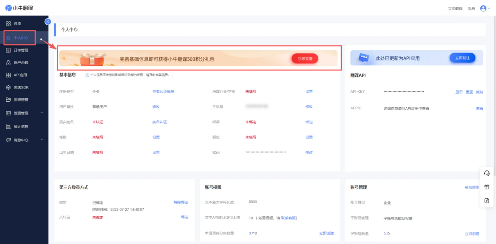
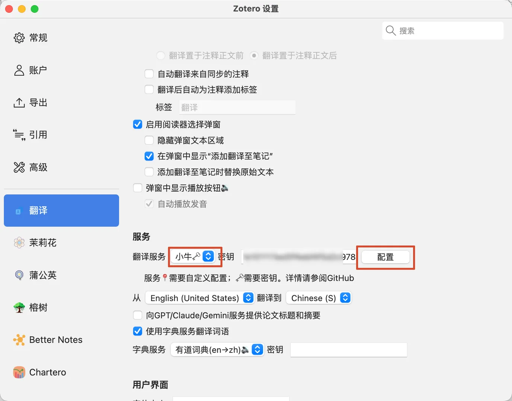
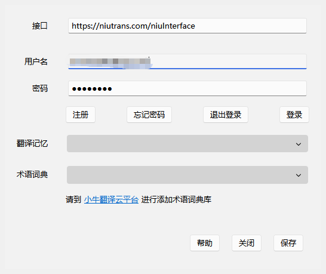
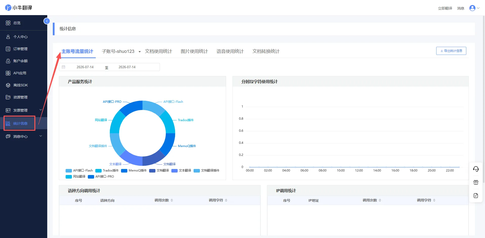
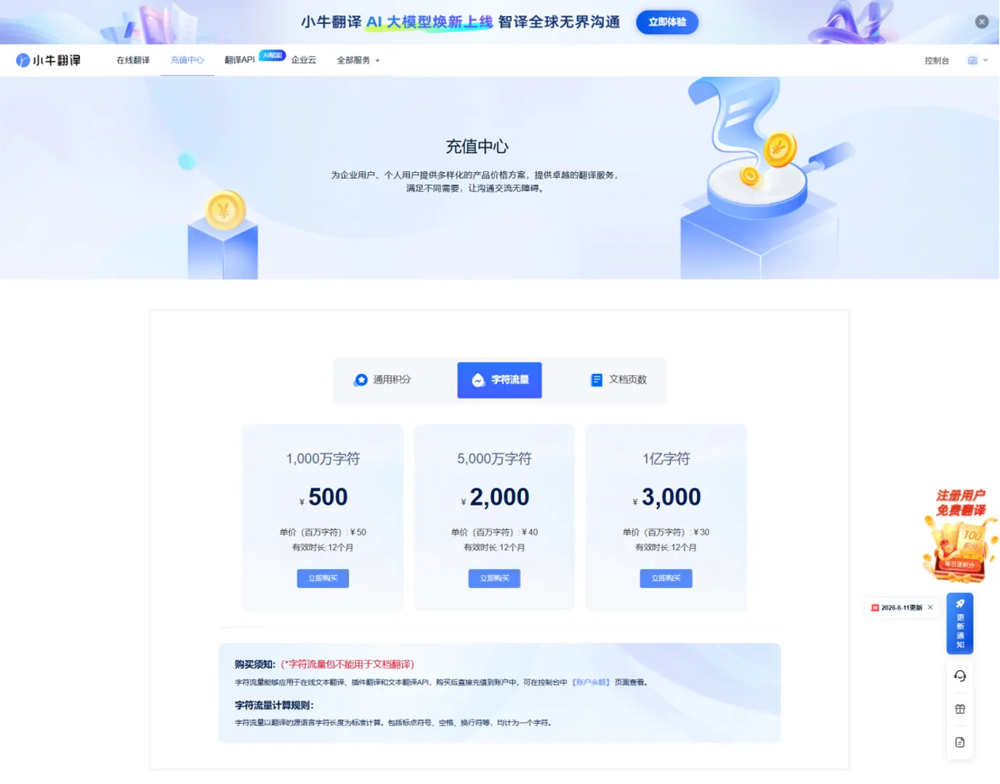

# 小牛翻译接口申请及配置

小牛翻译团队源自东北大学 NLP 实验室，深耕自然语言处理领域数十年，支持 454 种语言互译，拥有极速响应、高并发、高精度的翻译特性，可满足论文、文献等科研场景以及各类行业的翻译需求，面向科研用户提供稳定的翻译 API 服务。

## 免费额度说明

新用户注册即可领取 500 积分（100 万字符）；平台每日额外发放 100 积分（20 万字符）免费额度。

## 计费规则

免费额度使用完毕后，可选购通用积分包或字符流量包来调用翻译 API：

- 通用积分包：30 元可购买 300 积分，90 元可购买 900 积分；1 积分可完成 2000 字符翻译。
- 字符流量包：500 元可购买 1000 万字符额度，按照实际翻译消耗的字符数量扣费。

## 账号使用提示

小牛翻译云平台与 Zotero 翻译插件账号互通。注册账号后，可通过账号密码在 Zotero 翻译插件中登录；APIKEY 可在开放平台个人中心查看。

## 1. 账号注册

访问[小牛翻译开放平台](https://niutrans.com/)，点击页面右上角的「登录/注册」。

## 2. 完善账号信息

注册完成后，进入「控制台」→「个人中心」，完成基础信息填写并领取 500 积分礼包。

## 3. Zotero 翻译插件小牛翻译服务设置

打开 Zotero 客户端，并打开设置，在翻译服务下拉菜单中选择「小牛」，点击右侧「配置」按钮。

在输入框中填写刚刚注册的账号和密码。填写完成后保存设置即可生效。

## 4. 接口测试

全部配置完成后，可进行接口可用性测试。在 Zotero 中打开任意外文 PDF 文献，选中段落或专业词汇进行划词翻译或右键翻译。

若页面正常输出通顺、准确的中文译文，且无报错、无空白内容，即代表小牛翻译接口配置成功，可以正常使用。

## 5. 查询数据使用情况

进入「[控制台](https://niutrans.com/cloud/overview)」→「数据统计」，即可查看翻译接口的用量情况。

## 6. 购买字符流量或通用积分

登录小牛翻译云平台，进入「[充值中心](https://niutrans.com/price?type=integral)」，可购买所需的字符流量或通用积分。

