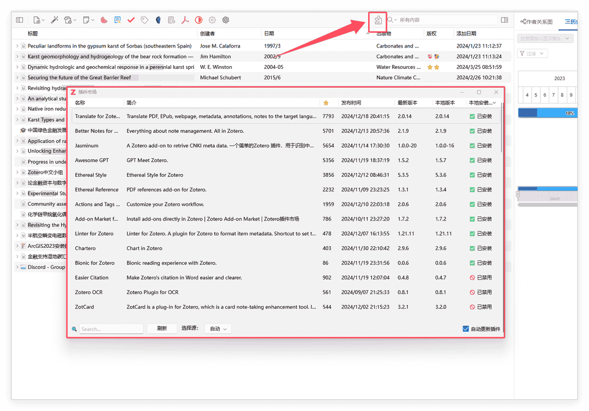
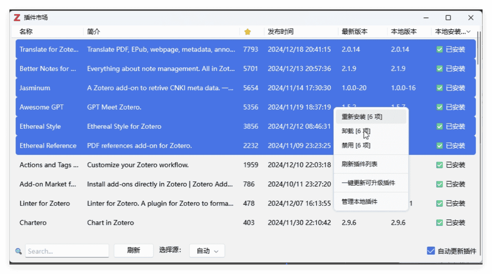
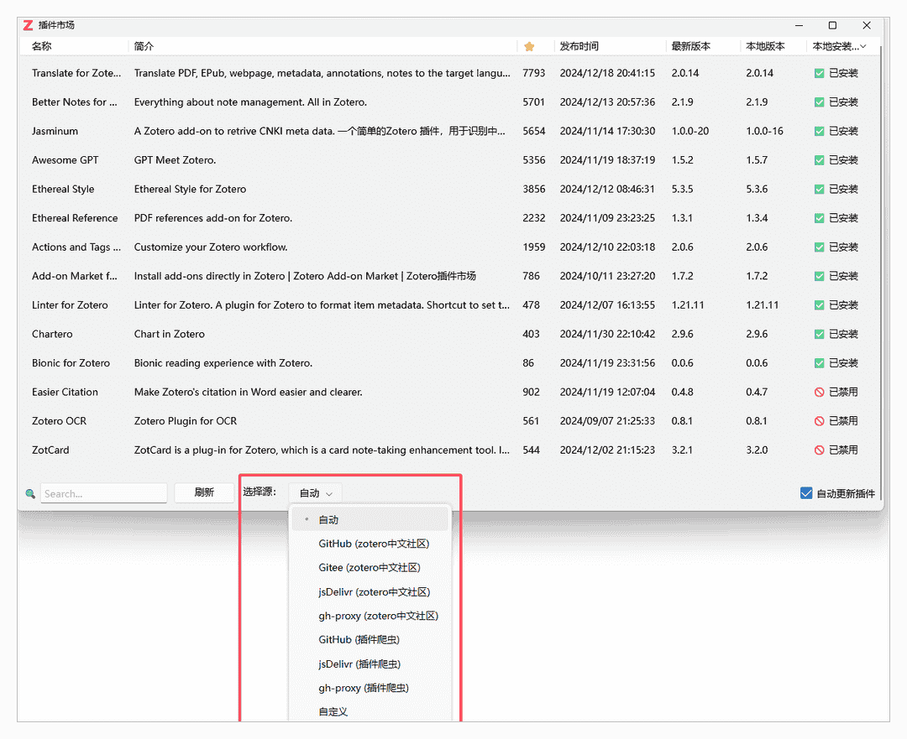

---
authors:
  - Chikit
date: 2024-12-20 20:31:17
---

# Zotero 插件市场插件

::: info 关于插件

这是一个用于在 Zotero 内浏览和安装插件的插件，简化插件管理和安装过程。用户可以通过该插件可以方便地查找、安装和更新 Zotero 插件。

- 项目主页：[GitHub](https://github.com/syt2/zotero-addons/tree/main)
- 插件下载地址
  - [国内镜像](https://zotero-chinese.com/plugins/#search=Add-on+Market+for+Zotero)
  - [GitHub Release](https://github.com/syt2/zotero-addons/releases)

:::

## 使用方法

安装完成后，您可以通过以下两种方式访问插件市场。

### 打开插件市场

#### 1. 通过工具栏按钮

点击 Zotero 工具栏中的插件按钮。

#### 2. 通过菜单

在 Zotero「工具」菜单中选择「插件市场」进入。

### 管理插件

在「插件市场」中可以快速实现插件的安装、更新、卸载、禁用等功能

### 自动更新插件

勾选右下键的 `自动更新插件` 后，Zotero 插件市场插件会在后台自动实现插件的更新。

## 插件数据源

插件市场提供多个数据源供用户选择，确保用户能够顺畅浏览和下载插件。

当 **插件列表无法刷新** 或者 **插件无法下载** 时，说明可能遇到了网络问题，此时可通过更换数据源来尝试解决。

### 默认数据源

#### Zotero 中文社区（`zotero-chinese/zotero-plugins`）

插件的主要数据源来自 Zotero 中文社区。若您是国内用户，推荐选择此数据源，以获取优化的插件列表。

在插件市场界面选择 `(zotero中文社区)` 即可使用该数据源。

#### 插件爬虫（syt2/Zotero-addons-scraper）

插件市场还提供另一数据源，通过插件爬虫从多个外部源抓取插件。选择 `(插件爬虫)` 数据源可以访问这些插件。

### 自定义源

本插件支持自定义数据源。如果您有自己的插件源，或想使用其他符合 `zotero-chinese/zotero-plugins` 格式的数据源，可以在插件设置中添加自定义源并提供数据源的 URL。

## 常见问题

### 1. **如何选择不同的数据源？**

在插件市场界面，您可以轻松切换不同的数据源，选择适合您需求的源来浏览插件。

### 2. **插件无法加载或显示空白怎么办？**

如果您遇到插件页面加载不出插件，建议尝试切换不同的数据源，特别是选择 `zotero中文社区` 数据源，这通常能解决问题。

### 3. **如何更新插件？**

安装的插件会定期检查更新，您也可以在插件市场界面中查看是否有更新，并根据需要进行更新。
