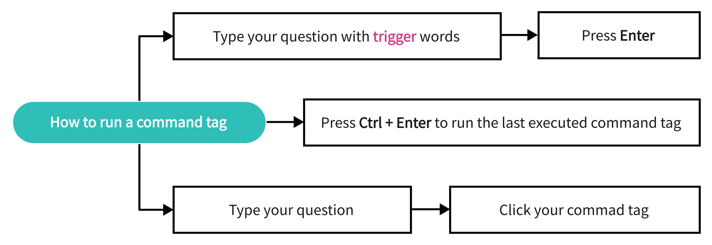
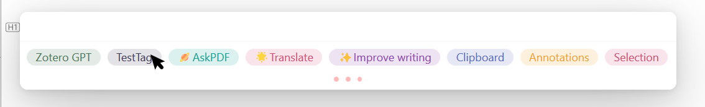

---
authors:
  - Chikit
date: 2024-04-15 20:31:17
---

# Awesome GPT for Zotero

Awesome GPT for Zotero 是一个由 MuiseDestiny 创建的开源 Zotero 插件。这个插件使得用户能够通过命令标签使用 Meet API，进一步增强 Zotero 与 GPT 模型（包括 gpt-3.5-turbo 和 gpt-4）的集成。

- 项目主页：<https://github.com/MuiseDestiny/zotero-gpt>
- 下载地址：[插件商店 - Zotero 中文社区](https://zotero-chinese.com/plugins/#search=gpt)。
- 视频教程：[Zotero GPT - 使用教程，配置免费密钥！！！](https://www.bilibili.com/video/BV17N4y1o7vx/)

<!-- <BiliBili bvid="BV17N4y1o7vx" /> -->

主要特点包括：

- ✅ **🔗 与 Zotero 集成**：您可以使用该插件，根据所选文本或 PDF 文件搜索和查询资料库中的项目。
- ✅ 🧠 使用 GPT 生成回复文本：支持 `gpt-3.5-turbo` 和 `gpt-4`
- ✅ **🏷️ 命令标签**：**点击一次**，加速研究。
- ✅ 💬 就当前 **PDF 文件**（全文或选定文本）提出问题。
- ✅ 💬 就**所选论文**（摘要）提问。
- ✅ 📝 将所选论文**概括**成几个高度浓缩的句子。
- ✅ 🔍 根据所选文本**搜索**图书馆中的项目。
- ✅ ⚙️ **GPT 的高级设置**：可以设置 api 密钥、型号名称、api 网址、温度。
- ✅ **与 Better Notes 集成**：使用 [Better Notes](https://github.com/windingwind/zotero-better-notes) 时可直接打开此插件。

用户界面功能

- ✅ 🎨 **实时标记回复文本**：支持 LaTeX 和 MathJax。
- ✅ 🔍 **放大或缩小**回复文本或插件窗口的大小。
- ✅ 🖱️ **将插件窗口移动到屏幕上的任意位置**。
- ✅ 将回复文本**复制到剪贴板**。
- ✅ ⚠️ 当**请求失败**时，将显示详细的错误信息。
- ✅ 🔧 与 **Zotero 6 和 Zotero 7 兼容**。

## 如何使用 Zotero GPT

### 基本操作

| 动作               | 快捷键                                                                                                                                                                     |
| ------------------ | -------------------------------------------------------------------------------------------------------------------------------------------------------------------------- |
| 打开               | `ctrl` + `/`                                                                                                                                                               |
| 退出               | `ESC`                                                                                                                                                                      |
| 多行编辑           | `Shift` + `Enter`                                                                                                                                                          |
| 放大/缩小/调整字号 | 在 回复区 按下`ctrl+滚轮`调整可以调整字体大小<br />在 指令区 按下 `ctrl+滚轮`调整命令框大小 |

除了使用快捷键`ctrl` + `/`使用`Zotero GPT`，你也可以通过工具栏的图标来实现快速访问


### 配置`Zotero GPT`

通过`ctrl + /`指令打开 Zotero GPT，然后输入`/secretKey sk-xxxxxxxxxxxxxxxxxxxxxxxxxxxxxxxxxxxxxxx`（这里要换成你自己的密钥），进行密钥的设置。
（也可以通过 `编辑`-`设置`-`高级`-`编辑器`-`extensions.zotero.zoterogpt.secretKey`中 查看/设置 自己的密钥）


如果你是用的是第三方所提供的 SecretKey，那么还需要输入`/api xxxxxxxxxxxxxxx`（具体的 api 通过查看第三方的网站获取。如果你是用的是 OpenAi 官方提供的密钥，那此时可以直接跳过设置。）

默认的模型使用的是`gpt-3.5-turbo`，如果你想使用 GPT4，那么你需要输入`/model gpt4`（前提是你已经购买 GPT4）

你也可以通过`/report`指令随时查看 Zotero GPT 的相关配置
注意：如果使用的官方密钥，那么此时`api`应该是`https://api.openai.com/`


设置好`SecretKey`和`api`以后，你的 Zotero GPT 已经可以正常使用了。


### 如何获取 SecretKey

密钥主要通过以下途径获取：

| 序号 | 来源         | 推荐指数   | 国内直连     | API 地址                 | 说明                                                                                                                                                                                                                                                                                                                                                                             |
| ---- | ------------ | ---------- | ------------ | ------------------------ | -------------------------------------------------------------------------------------------------------------------------------------------------------------------------------------------------------------------------------------------------------------------------------------------------------------------------------------------------------------------------------- |
| 1    | 官方         | ⭐⭐⭐⭐⭐ | 科学上网     | `https://api.openai.com` | 秘钥：[创建 secret key](https://platform.openai.com/account/api-keys) 支持模型：`gpt-3.5-turbo`、`gpt-4`（需申请 [gpt-4-api](https://openai.com/waitlist/gpt-4-api) ）                                                                                                                                                                                                           |
| 2    | 自建代理     | ⭐⭐⭐⭐   | 国内直连     | 取决于自建后台的设置     | 原理就是反向代理，需技术能力                                                                                                                                                                                                                                                                                                                                                     |
| 3    | Azure OpenAI | ⭐⭐⭐⭐   | 国内直连     | 管理面板`EndPoint`       | 价格与 OpenAI 一致 参考 [微软官方教程](https://learn.microsoft.com/zh-cn/azure/cognitive-services/openai/chatgpt-quickstart?tabs=command-line&pivots=programming-language-studio) 、 [其他教程](https://www.sunpop.cn/chatgpt_in_china_with_azure_openai_api_free_1_year_odoo/) 、 [azure api 转 openai](https://github.com/diemus/azure-openai-proxy/blob/main/README.zh-cn.md) |
| 4    | 第三方代理   | ⭐⭐       | 通常国内直连 | 商家提供                 | 信誉和技术能力决定安全性和可靠性 秘钥：需商家提供                                                                                                                                                                                                                                                                                                                                |
| 5    | 免费         | ⭐         | 通常国内直连 | 不确定                   | 不可靠、不稳定 可以从网上搜索热心人公开的秘钥                                                                                                                                                                                                                                                                                                                                    |

如果你没有密钥，并且不能访问 openai，那么推荐使用免费的[GPT-API-free](https://github.com/chatanywhere/GPT_API_free)项目

注意：使用该项目所获取的 SecretKey，api 应该更换成**`https://api.chatanywhere.tech`**或者**`https://api.chatanywhere.com.cn`**

### 使用`Zotero GPT`

> 触发器是命令标签的一个属性，颜色和位置也是如此。长按任意标签可查看/修改其触发词。它支持纯文本和 JS 正则表达式。



你可以通过以下四种方式与 GPT 进行交流

1. 问题 + 回车
   在输入框内输入你的问题，按下回车，此时与 GPT 直接进行对话

2. 问题 + 命令标签
   例如在输入框内输入`这篇文章的研究背景是什么`并点击`AskPDF`，此时 GPT 会对 PDF 进行阅读后回复你的问题。
   

3. 关键词触发命令标签
   命令标签也可以通过关键词进行触发
   例如在输入框内输入`这篇论文写了什么`，此时命令标签`AskPDF`会被选中，这时可以直接按下回车，实现问题+命令标签快速提问。
   该功能是通过命令标签中的`trigger`实现的，你可以对各个命令标签的`trigger`进行自定义
   

4.`Ctrl + 回车` 会自动执行上一次的命令标签

### 如何浏览历史聊天记录

> 按键盘上的上（↑）和下（↓）键切换。


## 常见问题

### The model does not exist

例如

```json
{
  "error": {
    "message": "The model: `gpt-4` does not exist",
    "type": "invalid_request_error",
    "param": null,
    "code": null
  }
}
```

解决方案

- 检查自己的`model`设置，确保属于为以下名字中的**某一个**：`gpt-4`， `gpt-4-0314`， `gpt-4-32k`， `gpt-4-32k-0314`， `gpt-3.5-turbo`， `gpt-3.5-turbo-0301`
- 若使用了`gpt-4`相关的模型，你需要保证自己具备使用`gpt-4`的权限，否则也是这样报错

### You exceeded your current quota

例如

```json
{
  "error": {
    "message": "You exceeded your current quota, please check your plan and billing details.",
    "type": "insufficient_quota",
    "param": null,
    "code": null
  }
}
```

这是因为你目前的 API 调用额度已经耗尽（或过期）了，参考官方回复[openai help articles](https://help.openai.com/en/articles/6891831-error-code-429-you-exceeded-your-current-quota-please-check-your-plan-and-billing-details)

解决方案

- 若你正在使用官方接口，请注册新账户，继续白嫖 5 美元免费额度。或者自己绑定付款方式
- 若使用其他来源的接口和秘钥，自己核对秘钥，或联系购买时的商家

### Invalid URL

例如

```json
{
  "error": {
    "message": "Invalid URL (POST /chat/completions)",
    "type": "invalid_request_error",
    "param": null,
    "code": null
  }
}
```

解决方案

- 若你正在使用官方接口，确保 api 设置为`https://api.openai.com`，一字不差
- 若使用其他来源的接口和秘钥，自己核对 API 地址，或联系购买时的商家

### Ask pdf 出错

例如

```
根据提供的上下文信息，Meet.Global.input 是一个变量或属性名。根据代码片段中的信息，我们可以确定以下几点：

首先，Meet.Global.views.messages 是Meet.Global 对象的一个属性，它被赋值为空数组[]。这个属性可能是用来存储消息或其他相关的数据。
其次，Meet.Zotero.getRelatedText() 是一个函数调用，它使用了Meet.Global.input作为参数。根据函数名和参数名，我们可以猜测这个函数的目的可能是获取一个与Meet.Global.input相关的文本信息。
然而，根据给定的上下文信息，我们无法准确确定Meet.Global.input的具体含义。它可能是一个用户输入的值、一个来自其他地方的数据，或者可能由其他代码定义并赋给了Meet.Global.input属性。
为了更好地回答这个问题，我们需要更多关于Meet.Global.input的上下文信息。如果您能提供更多代码或上下文信息，我将尽力帮助您解答问题。[1]
```

解决方案

`Ask pdf` 是一个针对全文进行提问的快捷命令，必须在 `ZoteroGpt` 的输入框中输入一些内容（也就是必须有提问的问题），再点击下方的命令标签（例如`AskPDF`）。若输入框为空（相当于你没问任何问题，它自然不知道要干什么），则不会解析命令语句。

例如你可以输入`本文创新点`、`解决的问题`等等，然后再点击`Ask pdf`。

## 命令标签的自定义

> 👻 按照下面的步骤操作，你将对命令标记有一个全新的认识。

| Step | 描述                                                 | Supplementary Information                                                           |
| ---- | ---------------------------------------------------- | ----------------------------------------------------------------------------------- |
| 1    | 打开 Zotero GPT                                      | 参考基本操作                                                                        |
| 2    | 请键入 `#Tag Name` 并按 `Enter`                      |        |
| 3    | 输入你的提示或代码                                   |  |
| 4    | 运行标签                                             | 按 `Ctrl + R`                                                                       |
| 5    | 保存标签                                             | 按 `Ctrl + S`                                                                       |
| 6    | 长按命令标签以访问编辑界面                           |      |
| 7    | 修改标签的颜色、位置或触发器；记得用 `Ctrl + S` 保存 |  |
| 8    | 按 `ESC` 退出编辑界面                                | 退出前记得用 `Ctrl + S` 保存更改                                                    |
| 9    | 长按鼠标右键删除标签                                 | 注意：内置标签不支持删除                                                            |

## 如何编写代码块

你可以在[这里](https://github.com/MuiseDestiny/zotero-gpt/blob/bootstrap/src/modules/Meet/api.ts)找到一些内置的应用程序接口。

举个简单的例子：

```
Summarize the following paragraph for me:

${Meet.Zotero.getPDFSelection()}
```

在这里， `Summarize the following paragraph for me:` 表示纯文本，而 `${your code}` 表示代码片段。毫无疑问，如果你熟悉 Zotero API，就可以开发自己的代码。代码片段将被执行，代码片段返回的文本将替换代码片段。最后，被替换的文本将被输入到 GPT 中。因此，理论上，您可以使用命令标签完成 Zotero 和 GPT 之间的所有交互。
