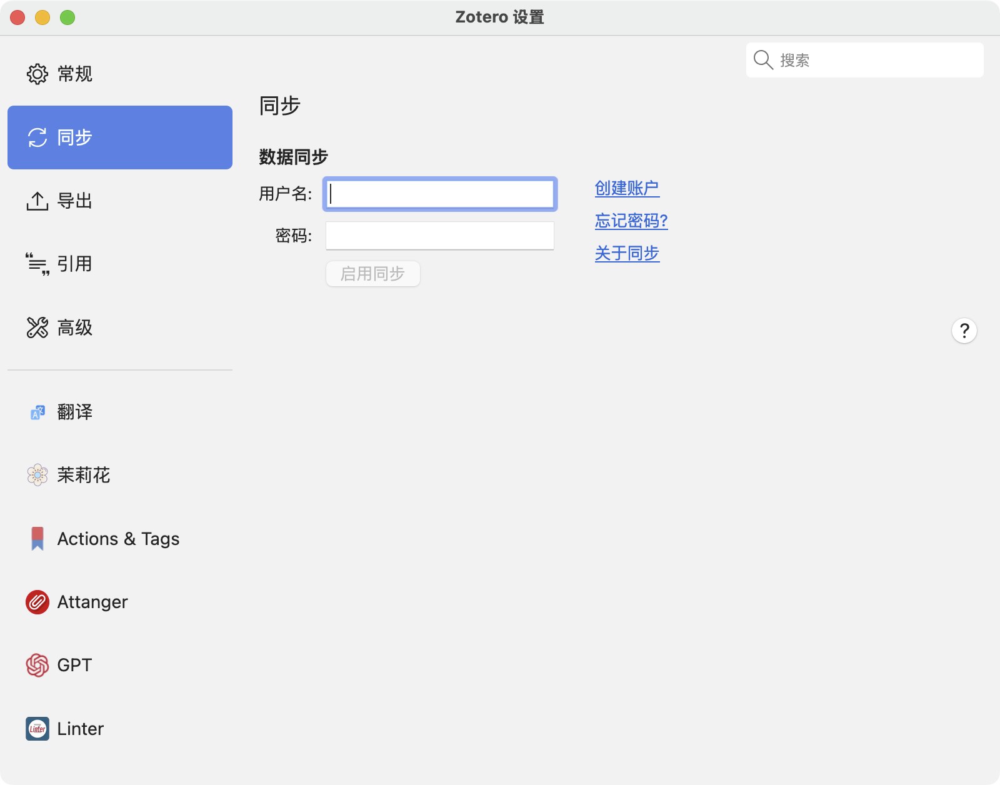
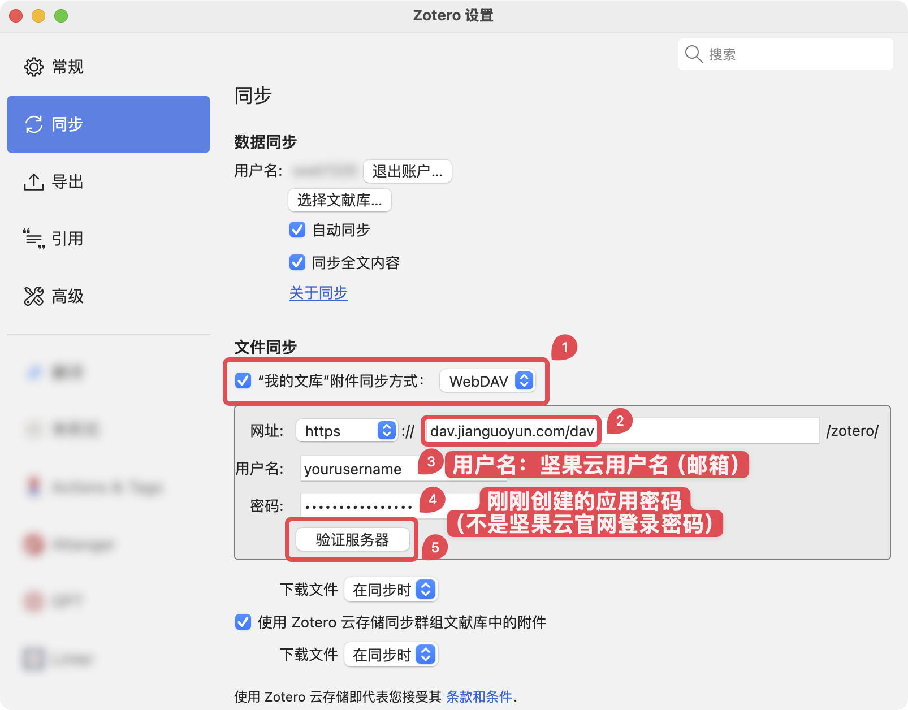
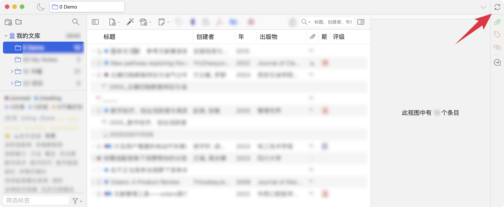
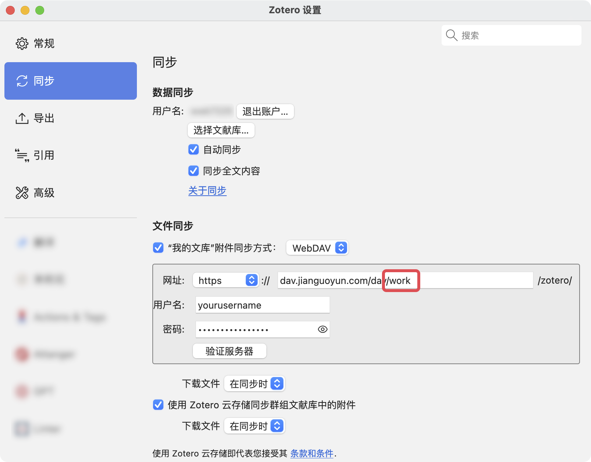

# 数据与文件的同步

我们在这里把同步分为「数据的同步」和「文件的同步」。

数据的同步指 `条目字段信息`、`批注`、`笔记` 的同步，这些数据仅能通过 Zotero 官方提供的服务同步。

文件的同步指 `PDF 附件`、`网页附件`、`Word 文档`、`EPub 文件` 等所有附件的同步。这些文件既可以通过 Zotero 官方服务同步，也可以通过 WebDAV 网盘来同步。

::: danger

无论你选择何种同步方案， 切勿将 Zotero 的 `数据存储位置/Data Directory Location` 自定义为任何网盘的同步文件夹中 （包括 iCloud），也切勿使用任何网盘/同步盘的备份功能直接同步/备份这一目录 ！（包括但不限于直接使用坚果云的官方客户端直接同步备份这一文件夹）

这样做在某些情况下可能会导致你的 Zotero 数据库损坏，带来严重的问题！官方对于这一问题的说明见这两篇文章：

- [How can I access my library from multiple computers?](https://www.zotero.org/support/sync#alternative_syncing_solutions)
- [Can I store my Zotero data directory in a cloud storage folder?](https://www.zotero.org/support/kb/data_directory_in_cloud_storage_folder)

:::

## 数据的同步

::: tip

无论如何，您都需要注册一个 Zotero 的官方账户，用于同步条目信息、批注以及笔记。如果您没有注册，可 [快速创建一个 Zotero 账户](https://www.zotero.org/user/register)。

:::

之后您可以在 `Zotero`-`编辑`-`设置`-`同步`-`设置`中 输入您的帐号密码，进行登陆。

每个 Zotero 用户都可以获得 300 MB 的免费 Zotero 存储空间，用于存储附加文件，并可 [购买更大的存储空间](https://www.zotero.org/settings/storage?ref=sib)。如果您拥有钞能力，这是最简单的备份方法，在登陆您的 Zotero 账户并完成购买后无需其他任何设置。

|    存储空间    |             费用 (USD)              |
| :------------: | :---------------------------------: |
|     300 MB     |                Free                 |
|      2 GB      | $20/year (equal to $1.67 per month) |
|      6 GB      |  $60/year (equal to $5 per month)   |
| Unlimited 无限 | $120/year (equal to $10 per month)  |

如果您想免费进行进行文件的同步，那么您具有两种网盘同步方式：**支持 WebDAV 的网盘（推荐）**和**第三方同步盘**。对于新手，建议从 WebDAV 网盘同步入手，在熟悉各种问题的解决方法和同步原理后，可尝试第三方网盘的同步方式。

::: tip

无论附件采用何种方式同步，条目信息、批注、笔记始终是通过 Zotero 官方的服务同步的。

不要担心，这部分占用的体积很小，只要不同步附件，官方的空间是足够的。

:::

::: warning

我们始终建议通过官方服务或 WebDAV 网盘进行附件同步。网上流传较广的 ZotFile 方案已经过时，不再被官方所推荐，且不支持移动端同步。

:::

## 通过 WebDAV 同步附件

::: tip 什么是 WebDAV

WebDAV 是一组基于超文本传输协议的技术集合，有利于用户间协同编辑和管理存储在万维网服务器文档。
通俗一点儿来说，WebDAV 就是一种互联网方法，应用此方法可以在服务器上划出一块存储空间，可以使用用户名和密码来控制访问，让用户可以直接存储、下载、编辑文件。

:::

目前常用的支持 WebDAV 同步的网盘包括[坚果云网盘](https://www.jianguoyun.com/)、[123 云盘](https://www.123pan.com/)、[InfiniCLOUDt](https://infini-cloud.net/en/index.html)，常见的如百度网盘、阿里云盘、OneDrive 等均不支持 WebDAV 同步。

我们只推荐使用**坚果云网盘**，后续教程也将以坚果云网盘为例。

如果您没有坚果云网盘的账户，请先 [注册坚果云](https://www.jianguoyun.com/d/signup)。

坚果云免费用户具有以下限制：

- 流量与空间限制：每月上传流量 1G/月、下载流量 3G/月、空间受限于上传流量，

- 文件上传大小限制：当前 WebDAV 客户端和网页端上传大小的限制是一致的，默认为 500M（私有云可以通过相关设置调整）。

- 访问频率限制：由于 WebDAV 协议比较占用系统资源，免费版用户限制访问频率为每 30 分钟不超过 600 次请求。付费用户限制访问频率为每 30 分钟不超过 1500 次请求。

当然对于大部分用户免费账户是完全够用的（虽然每个月只有 1g 上传流量，但是好处是每个月都可以有 1g，一年最多可以拥有 12g）。对于小部分用户，可通过付费[购买专业版](https://www.jianguoyun.com/s/pricing)或者使用其他支持 WebDAV 同步的网盘。

### PC 端

1. [登陆](https://www.jianguoyun.com/d/login)您的坚果云账户。

2. 登录后点击 右侧用户名=>账户信息

   

3. 选择安全选项，下滑到底，点击添加应用。

   

4. 完成后，记录下生成的密码。

   

   

5. 打开 `Zotero`，`编辑`——`设置`——`同步`——`文件同步`，使用 `Zotero` 改成 `WebDAV`，并填写你的坚果云的服务器地址：`dav.jianguoyun.com/dav`。
   用户名是坚果云账号，密码是上一步中的应用密码（非坚果云账号登录密码），设置好后点击 `Verify Server` 即可。

   

6. 到此处，电脑上关于坚果云的同步设置就完成了。

7. 回到首页，点击右边的绿色的圈就可以同步更新，如果是第一次设置，会提示在坚果云里自动创建一个名叫 `Zotero` 的文件夹，用于存放同步更新的文件。

   

::: details 自定义存放路径

如果在坚果云里新建了一个文件夹，想将文件放在那个文件夹里的话，那么在填写服务器地址时，需要添加对应的文件夹名字（建议文件夹用英文或数字命名），例如 work，那么服务器地址填写如下:

此时，你的 Zotero 的同步文件将会放在 `根目录/work/Zotero` 中。

:::

### iOS

见 [移动端](./mobile.md#ios)。

### Android

见 [移动端](./mobile.md#android)。

## 通过第三方网盘同步附件

::: danger

==我们不建议使用第三方网盘结合 ZotFile 的方式进行同步==。这会导致很多问题。除非你具备较强的问题排查能力，且对 ZotFile 所提供的功能有刚性需求，否则==请不要使用这种方法==！

:::

::: tip 施工中

[Alternative Syncing Solutions - Zotero Documentation](https://www.zotero.org/support/sync#alternative_syncing_solutions)

:::
