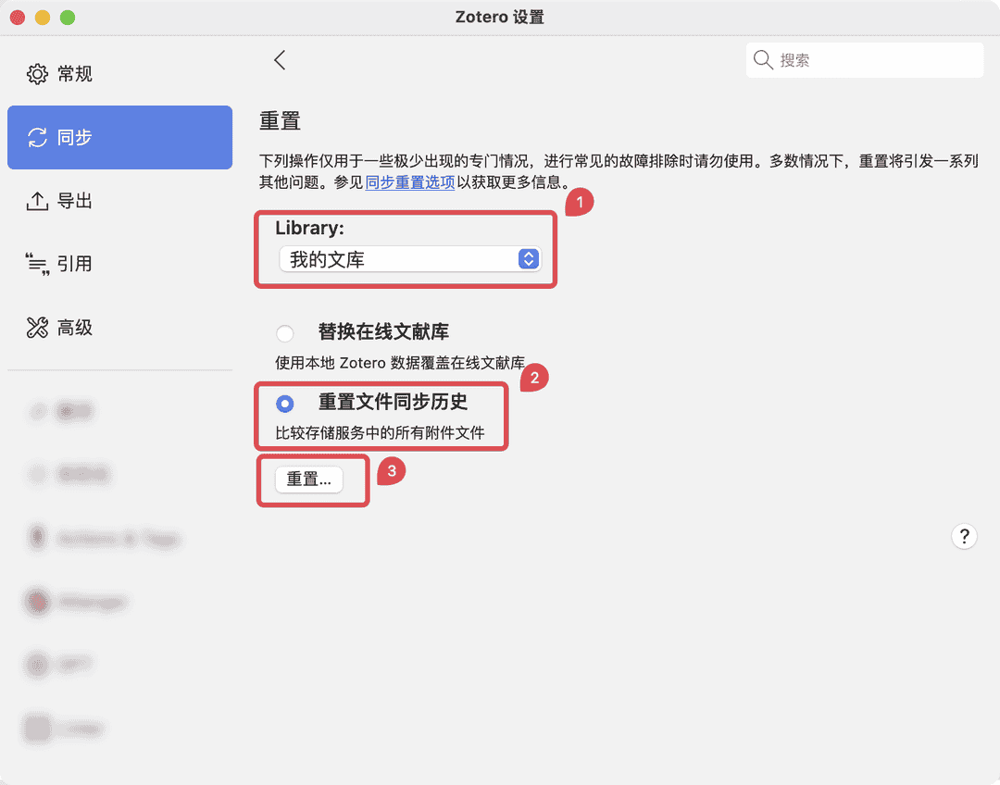

# 数据与文件的同步

我们在这里把同步分为「数据的同步」和「文件的同步」。

数据的同步指 `条目字段信息`、`批注`、`笔记` 的同步，这些数据仅能通过 Zotero 官方提供的服务同步。

文件的同步指 `PDF 附件`、`网页附件`、`Word 文档`、`EPub 文件` 等所有附件的同步。这些文件既可以通过 Zotero 官方服务同步，也可以通过 WebDAV 网盘来同步。

::: danger

无论你选择何种同步方案， 切勿将 Zotero 的 `数据存储位置/Data Directory` 自定义为任何网盘的同步文件夹中 （包括 iCloud），也切勿使用任何网盘/同步盘的备份功能直接同步/备份这一目录!（包括但不限于直接使用坚果云的官方客户端直接同步备份这一文件夹）

这样做在某些情况下可能会导致你的 Zotero 数据库损坏，带来严重的问题！官方对于这一问题的说明见这两篇文章：

- [How can I access my library from multiple computers?](https://www.zotero.org/support/sync#alternative_syncing_solutions)
- [Can I store my Zotero data directory in a cloud storage folder?](https://www.zotero.org/support/kb/data_directory_in_cloud_storage_folder)

:::

## 数据的同步

::: tip

无论如何，您都需要注册一个 Zotero 的官方账户，用于同步条目信息、批注以及笔记。如果您没有注册，可 [快速创建一个 Zotero 账户](https://www.zotero.org/user/register)。

:::

之后您可以在 `Zotero` → `编辑` → `设置` → `同步` → `数据同步`中 输入您的 Zotero 帐号密码，进行登录。

::: tip

无论附件采用何种方式同步，条目信息、批注、笔记始终是通过 Zotero 官方的服务同步的。

条目信息、批注、笔记都是不占用 Zotero 官方的免费存储空间的，目前也没有总量的限制。

:::

## 文件的同步

常用的文件同步方式有：

- **Zotero 官方存储空间**：Zotero 官方提供的存储空间，300 MB 免费。
- **WebDAV 同步**：坚果云网盘、InfiniCLOUD 等支持 WebDAV 的网盘，部分服务商有免费的使用额度。
- **第三方同步盘**：如 OneDrive、百度网盘、iCloud 等，结合 Attanger 等插件进行同步。

其中，Zotero 官方存储空间和 WebDAV 同步是官方推荐的同步方式，附件直接由 Zotero 进行管理，使用起来最为简单。第三方同步盘的方式则是通过 Attanger 等插件将附件转换为链接的附件进行同步，使用起来较为复杂，容易出现问题，且不支持 Zotero 官方的移动客户端。如果您不熟悉 Zotero 的同步原理，或者对问题排查没有信心，建议使用 WebDAV 同步。

以下是各种方式的对比：

|                   对比项                   | WebDAV 同步 | Attanger + 同步盘 方案 |
| :----------------------------------------: | :---------: | :--------------------: |
|                  配置难度                  |    简单     |          复杂          |
|             多台电脑上同步附件             |     是      |           是           |
| 更改附件存储位置/自定义存放附件的文件夹名  |     否      |           是           |
|               支持的网盘种类               |    很少     |          较多          |
| 是否可以在移动端 Zotero/Papership 打开附件 |     是      |           否           |

- 简单来说，如果你只是需要在两个电脑之间同步数据，在设置正确的前提下，两者个方案都可以实现同步，但在文件的管理方式上存在区别。
- 移动端则在应用的支持和使用体验上都有明显区别，主要体现在：「 WebDAV 方案 」可以选择的是官方的 Zotero 应用；「 Attanger + 同步盘 方案 」则更适合用 PDF Expert 或 Drawboard PDF 这一类的第三方 PDF 阅读器搭配 iCloud 或 OneDrive 直接从（整理好的）文件目录里打开 PDF 并批注和编辑。

::: warning

我们始终建议通过官方服务或 WebDAV 网盘进行附件同步。网上流传较广的 ZotFile/Attanger + 同步盘 方案已经过时，且无法在移动端 Zotero 应用上进行同步，不再被官方所推荐。

目前 Zotero 已经内置了较为完善 PDF 批注功能，且由 Zotero 内置阅读器标记的批注会直接存储在 Zotero 的数据库中，不会直接写入到 PDF 文件中。即便您使用 Attanger + 同步盘 方案，在用第三方阅读器直接打开 PDF 文件时，仍然是无法看到由 Zotero 内置阅读器标记的批注的。正因如此，我们不再建议使用 Attanger + 同步盘 方案。

:::

### Zotero 官方存储空间

Zotero 官方提供了存储空间用于存储文件附件，您可以在 `Zotero`-`编辑`-`设置`-`同步`-`文件同步`中选择 `Zotero` 作为附件的同步方式。

每个 Zotero 用户都可以获得 300 MB 的免费 Zotero 存储空间，用于存储附加文件，并可 [购买更大的存储空间](https://www.zotero.org/settings/storage?ref=sib)。如果您拥有钞能力，这是最简单的备份方法，在登陆您的 Zotero 账户并完成购买后无需其他任何设置。

|    存储空间    |             费用 (USD)              |
| :------------: | :---------------------------------: |
|     300 MB     |                Free                 |
|      2 GB      | $20/year (equal to $1.67 per month) |
|      6 GB      |  $60/year (equal to $5 per month)   |
| Unlimited 无限 | $120/year (equal to $10 per month)  |

如果您想免费进行进行文件的同步，那么您具有两种网盘同步方式：**支持 WebDAV 的网盘（推荐）**和**第三方同步盘**。对于新手，建议从 WebDAV 网盘同步入手，在熟悉各种问题的解决方法和同步原理后，可尝试第三方网盘的同步方式。

::: tip

不要担心，条目信息、批注、笔记都是不占用 Zotero 官方 300 MB 的免费存储空间的。只有文件附件同步才会占用空间，因此只要不使用 Zotero 官方的存储空间同步附件，就完全不用关心这一限制。

:::

### 通过 WebDAV 同步附件

::: tip 什么是 WebDAV

WebDAV 是一组基于超文本传输协议的技术集合，有利于用户间协同编辑和管理存储在万维网服务器文档。
通俗一点儿来说，WebDAV 就是一种互联网技术，应用此方法可以在服务器上划出一块存储空间，可以使用用户名和密码来控制访问，让用户可以直接存储、下载、编辑文件。

:::

目前常用的支持 WebDAV 同步的网盘包括[坚果云网盘（有免费额度）](https://www.jianguoyun.com/)、[123 云盘（需购买会员）](https://www.123pan.com/)、[阿里云盘（需购买三方权益包）](https://www.alipan.com/)、[InfiniCLOUD（有免费额度）](https://infini-cloud.net/en/index.html)。常见的如百度网盘、iCloud、OneDrive 等均不支持 WebDAV 同步。

我们只推荐使用**坚果云网盘**，后续教程也将以坚果云网盘为例。

如果您没有坚果云网盘的账户，请先 [注册坚果云](https://www.jianguoyun.com/d/signup)。

坚果云免费用户具有以下限制：

- 流量与空间限制：每月上传流量 1G/月、下载流量 3G/月、空间受限于上传流量，

- 文件上传大小限制：当前 WebDAV 客户端和网页端上传大小的限制是一致的，默认为 500M（私有云可以通过相关设置调整）。

- 访问频率限制：由于 WebDAV 协议比较占用系统资源，免费版用户限制访问频率为每 30 分钟不超过 600 次请求。付费用户限制访问频率为每 30 分钟不超过 1500 次请求。

当然对于大部分用户免费账户是完全够用的（虽然每个月只有 1g 上传流量，但是好处是每个月都可以有 1g，一年最多可以拥有 12g）。对于小部分用户，可通过付费[购买专业版](https://www.jianguoyun.com/s/pricing)或者使用其他支持 WebDAV 同步的网盘。

#### PC 端

1. 在[坚果云官网登陆](https://www.jianguoyun.com/d/login)您的坚果云账户。

2. 登录后点击 右侧用户名->账户信息

   

3. 选择安全选项，下滑到底，点击添加应用。

   

4. 完成后，记录下生成的密码。

   

   

5. 打开 `Zotero`，`编辑`——`设置`——`同步`——`文件同步`，将「「我的文库」附件同步方式」由 `Zotero` 改成 `WebDAV`，并填写你的坚果云的服务器地址：`dav.jianguoyun.com/dav`。
   用户名是坚果云账号，密码是上一步中的应用密码（非坚果云账号登录密码），设置好后点击 `Verify Server` 即可。

   

6. 到此处，电脑上关于坚果云的同步设置就完成了。

7. 回到首页，点击界面右上角的同步按钮就可以进行同步。如果是第一次设置，会提示在坚果云里自动创建一个名叫 `Zotero` 的文件夹，用于存放同步更新的文件。

   

::: details 自定义存放路径

如果在坚果云里新建了一个文件夹，想将文件放在那个文件夹里的话，那么在填写服务器地址时，需要添加对应的文件夹名字（建议文件夹用英文或数字命名），例如 work，那么服务器地址填写如下:

此时，你的 Zotero 的同步文件将会放在 `根目录/work/Zotero` 中。

:::

::: tip 提示

如果您使用了 WebDAV 同步做为您的附件同步方式，您无需下载坚果云官方的电脑客户端，只需在各个电脑上都参照本文档的教程，在 Zotero 同步设置中填写相应的同步设置即可。

:::

#### iOS

见 [移动端](./mobile.md#ios)。

#### Android

见 [移动端](./mobile.md#android)。

### 通过第三方网盘同步附件

::: danger

**我们不建议使用第三方网盘结合 Attanger 等插件的方式进行同步**。这会导致很多问题。除非你具备较强的问题排查能力，且对 Attanger 所提供的功能有刚性需求，否则**请不要使用这种方法**！

:::

如果您希望通过第三方同步盘来进行附件的同步，您可以使用 Zotero Attanger、ZotMoov 等插件来实现。

Zotero Attanger 这一类插件会将 Zotero 的 PDF 附件转换为链接的附件，并将其存储在指定的文件夹中。您可以直接将存储附件的目标文件夹放置在 百度网盘同步盘、阿里云盘备份盘、iCloud、OneDrive 等云盘目录中，也可以使用坚果云官方客户端等工具在不同设备之间同步这一文件夹。不过，**请务必注意，请不要将存储附件的目标文件夹选为 Zotero 的数据目录，更不要将 Zotero 的数据目录用任何手段进行同步。**

在使用这一方案时，附件会由「存储的附件」转换为「链接的附件」，这样会导致无法直接通过 Zotero 本身的「删除条目」功能来删除附件。您需要使用 Zotero 的「显示文件位置」功能，手动删除文件夹中的文件。此时，您可能需要借助 [Del Item With Attachment 插件](https://zotero-chinese.com/plugins/#search=Del+Item+With+Attachment)提供的「删除条目和附件」功能进行删除。详见：[[常见问题] Zotero 中删除附件时，系统中的文件无法同步删除](./plugins/zotero-attanger#_5-1-zotero-中删除附件时-系统中的文件无法同步删除)

如果您确定要使用第三方网盘同步附件，您可以参考下面的教程：

- [Zotero Attanger 插件教程](./plugins/zotero-attanger)

您也可以使用 [ZotMoov 插件](./plugins/zotmoov) 作为替代来实现附件的同步。但我们仍然建议您完全理解每一项设置的含义后再进行使用。

::: warning 提醒

选用这一同步方式时，我们强烈建议您仔细地阅读 [Zotero Attanger 插件教程](./plugins/zotero-attanger)，详细了解各项设置的含义和使用方法，以及文档中提到的各个注意事项。错误的设置可能会导致附件丢失或无法同步。

:::

### 从 Attanger/ZotMoov + 同步盘方案 迁移到 WebDAV 同步方案

如果您已经使用了 Attanger + 同步盘 方案，并希望迁移到 WebDAV 同步方案，您可以参考下面的教程：

- [由链接的附件转换为存储的附件](./plugins/zotero-attanger#六、由链接的附件转换为存储的附件)

在迁移完成后，我们建议您禁用 Attanger/ZotMoov 插件，或修改插件设置，不再将附件转换为链接的附件，确保后续的新附件均存储为「存储的附件」，由 Zotero 直接管理。

### 问题排查

#### WebDAV 同步问题

如果您在使用 WebDAV 同步时遇到问题，附件无法打开，请您按照以下步骤处理：

1. 检查附件在添加时的设备上能否正常打开。如果在所有设备上都无法打开，您可能需要重新下载这一附件并重新添加至 Zotero。
2. 检查是否有附件是链接的附件。如果是链接的附件，附件图标上有一个小链条，这种附件是无法通过 WebDAV 同步的。请按照这篇教程处理：[由链接的附件转换为存储的附件](./plugins/zotero-attanger#六、由链接的附件转换为存储的附件)。
3. 检查每一个设备上的 WebDAV 同步设置是否正确（移动端 Zotero 应用也需要设置 WebDAV 同步，详见：[移动端配置教程](./mobile)），点击「验证服务器」按钮，确保验证成功。如果验证失败，请检查 Zotero 联网是否正常，并重新按照文档检查同步设置。
4. 如果仍然无法解决问题，请在 Zotero 设置中的「同步」→「重置」中点击「显示重置选项」，然后在「Library」中选择「我的文库」，选中「覆盖文件同步历史」，点击「重置...」按钮。最后，点击 Zotero 界面右上角的同步按钮，耐心等待同步完成后再在其他设备上重新尝试同步。
   
   

#### Attanger/ZotMoov 同步问题

如果您使用了 Attanger/ZotMoov 插件搭配同步盘进行附件同步，附件无法打开，请阅读下面的教程处理：

- [Zotero Attanger 常见问题](./plugins/zotero-attanger#五、常见问题)
