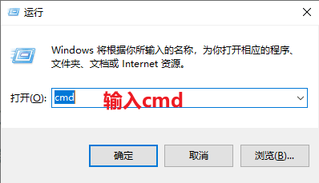
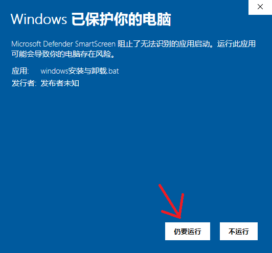
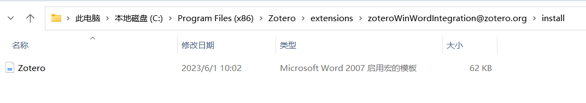
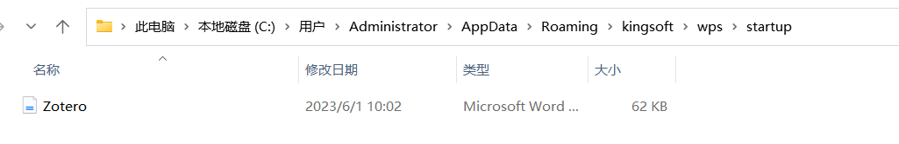

# 在 WPS 中插入参考文献

在 WPS 中使用插件参考文献，目前有三种方法

- 使用 WPS-Zotero插件（tankwyn开发，wangrui5015修改），支持Win/Linux/Mac三种平台的WPS和Zotero
- 使用 VBA，借用 Word 的插件
- 使用 WPS JavaScript API 制作的插件

wangrui5015修改版本的WPS-Zotero插件地址：[https://gitee.com/wangrui5015/Zotero-WPSJS](https://gitee.com/wangrui5015/Zotero-WPSJS)

使用 WPS 的 VBA 插件插入参考这篇：[完美在 WPS 中使用 Zotero 的方法](https://zhuanlan.zhihu.com/p/579975093)，该方法这个方法需要依赖 WPS 的 VBA 环境，需要升级到某些付费版本才行（当然也有破解版）。

下面是使用 WPS 原生 JavaScript API 插件的教程。

::: tip macOS 系统上的 WPS 用户暂时无法使用

插件是利用 WPS 提供的 JavaScript API 从 Zotero 获取引文信息，并写入到 WPS 文档中。目前插件可以在**Windows 和 Linux 系统**下使用，因 WPS 的接口暂时不支持 macOS 系统，所以**使用苹果电脑的同学暂时用不上这个插件**。

插件地址为 [https://github.com/tankwyn/WPS-Zotero](https://github.com/tankwyn/WPS-Zotero)

:::

## 1. 安装插件

因为 WPS 接口的一些限制，本插件的使用还需要使用到**Python3**，Linux 系统内一般默认安装了 Python3， 使用 Windows 的同学，需要提前安装好 Python3。使用 Windows 的同学从下面的 `1.1 Windows 下 Python3 环境的安装` 部分开始，使用 Linux 的同学可直接跳过这部分，看后面的安装部分就行。

### 1.1 Windows 下 Python3 环境的安装

可能有一些同学的电脑里已经安装 Python3，可以按 `WIN + R`，在弹出的窗口输入 `cmd`

点击确认后，再出现的小黑屏上输入 `python --version`

注意看，只要出现 `Python 3.xx.xx`，就说明 Python3 已经正确安装，直接进入下一步。如果出现其他的，说明 Python3 未正确安装，请按下面的步骤进行安装。

下载 Python3 安装包，[64 位下载地址](https://www.python.org/ftp/python/3.11.5/python-3.11.5-amd64.exe)，[32 位下载地址](https://www.python.org/ftp/python/3.11.5/python-3.11.5.exe)，不知道自己电脑是几位的，就选 64 位。如果上面两个链接下载太慢 (不开代理 ，官网下载速度慢已经 10 多年了)，可试试安装 [miniconda](https://mirrors.tuna.tsinghua.edu.cn/anaconda/miniconda/Miniconda3-py39_23.5.2-0-Windows-x86_64.exe)。

这里以 miniconda 示例，安装时默认设置，除了下面截图的设置，要记得打勾，把 Python 添加到环境变量里

安装了官网 Python 的同学，需要手动将 Python 添加到环境变量里

安装成功后，在小黑屏运行 `python --version`，出现 `Python 3.xx.xx` 说明安装成功。

### 1.2 安装 WPS 插件

安装过程非常简单，作者已经帮我们处理好了，只需要一个脚本即可。如果你可流畅访问 GitHub，可直接到 <https://github.com/tankwyn/WPS-Zotero> 下载，如果访问困难，可到这个 [镜像源](https://ftp.linxingzhong.top/WPS-Zotero.tar.gz) 下载

将下载后的压缩包解压后，看到的文件如下

#### Windows 系统

Windows 系统直接双击 `windows安装与卸载.bat` 安装文件，你可能会遇到下面的警告提示

运行后出现的提示窗口，输入 `1`，并按确认，进行安装

安装成功的提示

#### Linux 系统

直接打开 terminal，输入 `python3 install.py` 进行安装

## 2. 插件使用

WPS 插件的按钮与 Word 插件类似

- Add/Edit Citation，添加引用文献
- Add/Edit Refs，添加参考文献列表
- Refresh，刷新文档引用文献信息
- Preferences，打开 Zotero 引用设置窗口
- Add Note，添加 Zotero 笔记
- Unlink，取消链接引注，通过删除域代码来取消文档中 Zotero 引文的链接。这可以防止引文和书目的任何进一步自动更新。请注意，**删除域代码是不可逆的**，通常只能在文档的最终副本中完成
- Export，导出其他文本编辑器兼容的文本格式
- About，插件相关信息

具体的操作过程，请参考 [在 Word 中插入参考文献](./ms-word-plugin.md)

## 3. 如何卸载 WPS 安装的旧版 Zotero 扩展

如果你之前安装把 Word 里的 Zotero 插件强行安装到 WPS，那样出现多个的 Zotero 选项

先打开 `C:\Users\你的用户名\AppData\Roaming\kingsoft\wps` 目录 (注意用户名换成你自己的)，找到 `startup` 目录，删掉里面的 `zotero.dotm` 文件，这个文件是直接从 Zotero 的 Word 插件里复制到 WPS 里，需要 WPS 有 VBA 环境，现在已经不需要了，可以删掉。

## 4. 可能遇到的问题

### 4.1 不会自动出现

使用中可能点击按钮后，Zotero 的窗口不会自动出现，可以手动点击一下任务栏中的 Zotero 图标，让 Zotero 的窗口跳到最前。

### 4.2 插件安装后 WPS 内不显示

该部分教程来自与[官方文档](https://p.kdocs.cn/s/ZPIJCBAABE)

若安装 Zotero 插件后，打开 WPS 不显示，请按照以下步骤操作：

1. 关闭 WPS。
2. 打开 Zotero 的安装包路径
   `C:\Program Files (x86)\Zotero\extensions\zoteroWinWordIntegration@zotero.org\install`
3. 找到文件 Zotero.dotm，复制
   
4. 将第 3 步复制的文件粘贴到以下目录路径
   C:\Users\Administrator\AppData\Roaming\kingsoft\WPS\startup
   
5. 重启 WPS，即可看到 Zotero 插件
   
